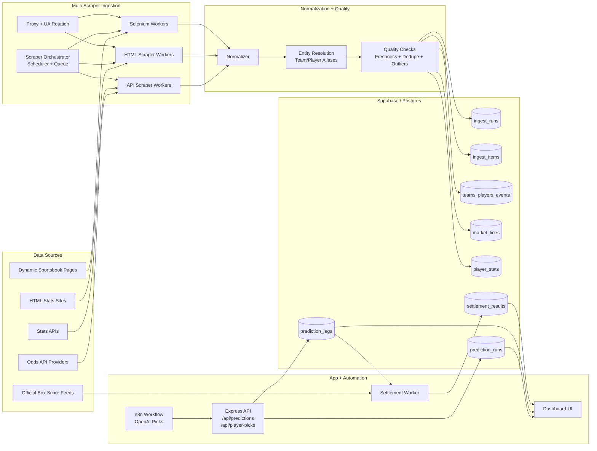

# Scraping + Supabase Architecture

## Goal
Support player-level betting picks and player-stat-backed settlement by adding a multi-source ingestion platform feeding a canonical Supabase data model.

## Source Strategy
- Preferred: official/partner APIs for odds and stats.
- Secondary: HTML parsing for static pages.
- Last resort: Selenium for JS-rendered pages where permitted.
- Compliance gate: each source requires terms/legal review, rate-limit policy, and fallback source.

## System Components

### 1) Ingestion Layer
- `scraper-orchestrator`: schedules jobs by sport/source/market and tracks run status.
- `api-scraper workers`: pull odds/stats APIs.
- `html-scraper workers`: parse non-JS pages.
- `selenium workers`: collect dynamic props/odds.
- `proxy + user-agent rotation`: reduce blocking for non-API scrapers.

### 2) Processing Layer
- `normalizer`: maps source payloads into canonical entities.
- `entity-resolution`: resolves player/team aliases.
- `quality checks`: freshness, null checks, outlier odds detection, and dedupe.

### 3) Storage Layer (Supabase/Postgres)
- Raw audit tables: `ingest_runs`, `ingest_items`.
- Canonical tables: `teams`, `players`, `events`, `market_lines`, `player_stats`.
- Prediction tables: `prediction_runs`, `prediction_legs`, `settlement_results`.

### 4) App/Automation Layer
- Express APIs ingest structured picks and serve dashboard reads.
- n8n workflow posts AI picks to prediction endpoints.
- Settlement worker resolves both team and player legs from official stat feeds.

## Canonical Data Model

### Core Entities
- `sportsbooks(id, name, region, source_type)`
- `teams(id, canonical_name, league)`
- `players(id, canonical_name, team_id, league)`
- `events(id, sport, league, starts_at, home_team_id, away_team_id, status)`
- `market_lines(id, event_id, sportsbook_id, market_type, selection_type, player_id, line_value, odds_american, pulled_at)`
- `player_stats(id, player_id, event_id, stat_type, stat_value, source, recorded_at)`

### Predictions + Settlement
- `prediction_runs(id, source_run_id, title, ai_summary, raw_message, created_at)`
- `prediction_legs(id, prediction_run_id, leg_type, event_id, team_id, player_id, market_type, pick_direction, line_value, odds_american, confidence)`
- `settlement_results(id, prediction_leg_id, result, resolved_at, resolver_source)`

### Ingestion Audit
- `ingest_runs(id, source_name, run_type, started_at, completed_at, status, error_summary)`
- `ingest_items(id, ingest_run_id, source_key, payload_json, normalized_ok, dedupe_key)`

## Mermaid Architecture Diagram

